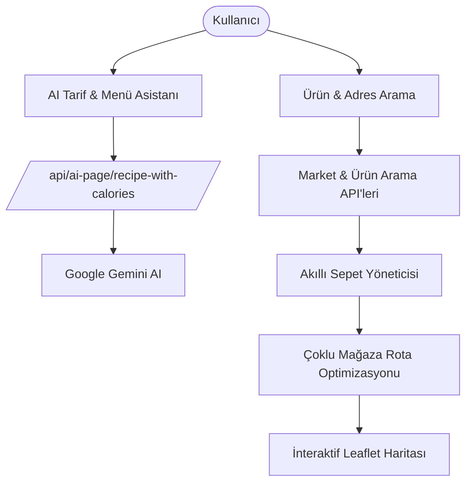

# 🛒 Market AI - Smart Grocery Price Optimizer & Recipe Planner

[](https://www.typescriptlang.org/)
[](https://nextjs.org/)
[](https://reactjs.org/)
[](https://tanstack.com/query)
[](https://leafletjs.com/)
[](https://deepmind.google/technologies/gemini/)
[](https://www.yucelgumus.dev/)

> Farklı market zincirleri arasındaki ürün fiyatlarını karşılaştıran, en ekonomik sepeti oluşturan, **Google Gemini AI** ile kullanıcı hedeflerine göre yemek tarifleri & kalori hesaplamaları yapan ve en uygun market alışveriş rotasını haritada optimize eden akıllı alışveriş asistanı.

---

## 🌟 Öne Çıkan Özellikler

- 💰 **Çoklu Market Fiyat Karşılaştırması:** Aynı ürünün seçili şubelerde market servisinden alınan fiyat kayıtlarını kıyaslama. Fiyat kontrol zamanı gösterilir; mağazanın güncel fiyatı veya stok durumu garanti edilmez.
- 🍳 **Yapay Zeka Destekli Tarif & Kalori Planlayıcı (`AI Recipe Pipeline`):** *"4 kişilik bütçe dostu ve 500 kalorilik akşam yemeği"* gibi isteklerle anında malzeme listesi ve tarif üretimi.
- 🛍️ **Sepet Tercihleri:** Aynı ürün ve adetlerle tek şube, en fazla iki şube veya ürün toplamı en düşük seçeneklerini karşılaştırma. Tek/iki şubede tüm şube kombinasyonları değerlendirilir; ürünler mağaza sınırı için listeden düşürülmez.
- 🗺️ **Çoklu Mağaza Rota Planlama:** Şube kimliği üzerinden ayrı duraklar oluşturma, yaklaşık durak sırası ve haritada araç rotası gösterme. Eksik koordinat varsa tam alışveriş rotası engellenir; en kısa rota garantisi verilmez.
- 📦 **Adet ve Fiyat Kontrolü:** Paket/adet düzenleme, eski sepetlerin taşınması, fiyatları yeniden kontrol etme ve en ucuz tam tek şube sepetine göre maliyet farkını gösterme.
- ✅ **Doğrulanmış Malzeme Seçimi:** AI yanıtları gerçek aday ürünlerle malzeme bazında eşleştirilir. Hatalı veya eksik seçimlerde rastgele ürün eklemek yerine kullanıcıdan aday ürün seçmesi istenir. Yeni tarif mevcut sepeti silmez.
- 📍 **Konum & Mesafe Filtreleme:** Kullanıcının mevcut adresine veya seçtiği konuma göre en yakın mağazaları filtreleme.

---

## 🏗️ Mimari & Modül Hiyerarşisi



| Özellik Grubu | İlgili Dizin / Dosya | Açıklama |
| :--- | :--- | :--- |
| **Ürün & Sepet** | `src/features/products/` | Ürün arama, filtreler, sepet özeti ve açılır menüler |
| **Market & Rota** | `src/features/markets/` | Market kartları, mesafe seçimi ve harita markerları |
| **Yapay Zeka** | `src/features/ai-chat/` | Gemini tarif hattı ve kalori hesaplayıcı |
| **Harita** | `src/components/MarketMap.js` | Dinamik Leaflet market ve rota haritası |

---

## 🚀 Hızlı Başlangıç

### Gereksinimler
- **Node.js**: v18.18+ veya v20+
- Market ve adres servislerine erişim
- Ayrı Python AI backend'i ve bu backend'e erişim anahtarı (tarif özellikleri için)

### Kurulum

```bash
git clone https://github.com/yucel-gumus/market-ai.git
cd market-ai

npm install
```

### Ortam Değişkenleri (`.env.local`)

```env
MARKET_API_URL=https://api.marketfiyati.org.tr/api
ADDRESS_API_URL=https://harita.marketfiyati.org.tr/Service/api/v1
PYTHON_API_URL=http://localhost:8000
PYTHON_API_KEY=your_python_backend_client_api_key
```

Bu depo Next.js arayüzünü ve proxy endpoint'lerini içerir. Python backend ayrı çalıştırılır; model sağlayıcısı ve onun anahtarları backend tarafında yapılandırılır. Next.js tek başına `GEMINI_API_KEY` ile tarif üretemez.

### Çalıştırma

```bash
npm run dev
```

Uygulamaya tarayıcınızdan `http://localhost:3000` adresinden erişebilirsiniz.

---

## Sepet Hesaplamalarının Sınırları

- Şube gruplaması `depotId` ile yapılır; aynı zincirin farklı şubeleri ayrı duraktır.
- Maliyet, birim paket fiyatı × adet üzerinden hesaplanır. Tarif gramajından paket sayısı otomatik türetilmez; kişi sayısı tarif isteğine aktarılır ve paket adedi kullanıcı tarafından düzenlenir.
- Tasarruf, aynı ürün ve adetlerin tamamını karşılayan en ucuz tek şubenin maliyetiyle karşılaştırılır. Böyle bir şube yoksa tasarruf rakamı gösterilmez.
- Ürün toplamı yol, yakıt ve zaman maliyetini içermez. Seçeneklerde kuş uçuşu mesafeden yaklaşık yürüyüş süresi gösterilir; harita servisi yanıt verdiğinde rota modalinde araç mesafesi ve süresi gösterilir. Eve dönüş ve alışveriş süresi dahil değildir.
- Fiyat kontrol zamanı market API yanıtının alındığı zamandır; kaynağın fiyat güncelleme tarihi değildir. Kontrol zamanı bilinmeyen veya 30 dakikadan eski kayıtlar belirtilir. Yenileme başarısızsa önceki kayıt ve zamanı korunur.
- Konum veya şube seçimi değiştiğinde önceki şubelerin fiyatları karşılaştırmaya katılmaz. Seçili şubede fiyatı olmayan ürünler görünür kalır ve yeniden kontrol edilmesi istenir.

## Doğrulama

```bash
npm test
npm run lint
npx tsc --noEmit --incremental false
npm run build
```

Tarayıcı regresyon testlerini çalıştırmak için:

```bash
npx playwright install chromium
npm run test:ui
```

`test:ui` yerel geliştirme sunucusunu 3016 portunda başlatır, bağımsız bir tarayıcı oturumu kullanır ve test sonunda kapatır. Market, AI ve rota yanıtları test verileriyle sağlanır; gerçek backend veya ücretli model çağrısı gerekmez. Testler mağaza tercihlerini, adetlerin kalıcılığını, fiyat yenilemesini, başarısız yenilemede kayıtların korunmasını, AI hata durumunda malzeme başına manuel seçimi, rota callback'lerini, değişen şube seçimini ve 390 px mobil taşmayı kapsar. Ekran görüntüleri `test-results/` altına yazılır.

Hazır çalışan sunucu için `UI_TEST_BASE_URL`, kurulu tarayıcı için `PLAYWRIGHT_CHROMIUM_EXECUTABLE` ortam değişkenleri kullanılabilir.

---

## 📂 Proje Dizin Yapısı

```
market-ai/
├── package.json
├── tailwind.config.ts
├── next.config.ts
└── src/
    ├── app/
    │   ├── page.tsx                    # Ana sayfa
    │   ├── product-search/             # Ürün arama sayfası
    │   ├── ai-chat/                    # Yapay zeka tarif sayfası
    │   └── api/                        # Market, ürün ve AI endpoint'leri
    ├── features/
    │   ├── products/                   # Ürün özellikleri ve sepet kancaları
    │   ├── markets/                    # Market filtreleri ve kartları
    │   ├── address/                    # Adres arama ve konum ayrıştırma
    │   └── ai-chat/                    # Gemini tarif akışı
    ├── components/                     # Harita, Navbar ve temel UI bileşenleri
    ├── lib/                            # Coğrafi hesaplamalar, proxy ve yardımcılar
    └── store/                          # Global Zustand state'i
```

---

## 📄 Lisans
Bu proje [MIT Lisansı](LICENSE) ile lisanslanmıştır.

---

## 👨‍💻 Geliştirici & İletişim

**Yücel Gümüş** - Full Stack Developer

- 🌐 **Web Sitesi / Portfolyo:** [yucelgumus.dev](https://www.yucelgumus.dev/)
- 💼 **LinkedIn:** [linkedin.com/in/yucel-gumus](https://www.linkedin.com/in/yucel-gumus/)
- 🐙 **GitHub:** [@yucel-gumus](https://github.com/yucel-gumus)

<p align="left">
  <a href="https://www.yucelgumus.dev/" target="_blank" rel="noopener noreferrer">
    
  </a>
</p>

## API sayfalaması ve güvenli tarif seçimi

Ürün araması bütün sayfaları otomatik yükler; alınan ve toplam ürün sayısı gösterilir. Sayfa hatasında kısmi sonuç tamamlanmış gibi sunulmaz ve kaldığı yerden yeniden denenebilir. Sunucunun sayfa boyutunu düşürmesi ve aynı ürünün farklı sayfalarda farklı şube teklifleriyle görünmesi desteklenir.

Tarif adayları güncel V3 kategori ağacı ve malzeme uygunluğu ile daraltılır. Fiyat, uygunluk kontrolünden sonra değerlendirilir. Python backend her malzemeyi kendi aday grubuyla işler; seçim ürün kimliğiyle doğrulanır. Model hatasında veya belirsiz seçimde otomatik ürün eklenmez. Backend ve frontend birlikte güncellenmelidir.

- `npm run test:live`: çalışan uygulama üzerinden canlı Market Fiyatı sayfalama/kategori/kimlik eşitleme testi. Varsayılan adres localhost:3015; `MARKET_LIVE_BASE_URL` ile değiştirilebilir.
- `npm run test:backend`: yapılandırılmış backend'in güvenli seçim sözleşmesini doğrular; model çağrısı yapmaz.
- [Yayın hazırlığı ve sürüm bağımlılığı](docs/RELEASE_READINESS.md)
- [API denetimi ve endpoint envanteri](docs/TUBITAK_API_AUDIT.md)
